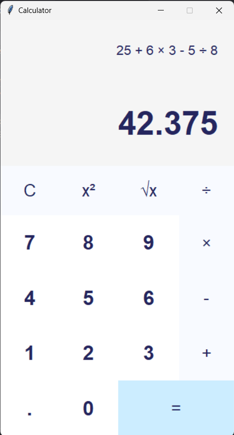

# Calculator-GUI-Tkinter
This is a simple calculator application built using Python and the Tkinter library. The calculator provides basic arithmetic operations, such as addition, subtraction, multiplication, and division. It also includes additional features like square and square root calculations.



## Features

- Arithmetic operations: Addition, subtraction, multiplication, and division.
- Square calculation: Calculate the square of a number.
- Square root calculation: Calculate the square root of a number.
- Error handling: Display "Error" if the expression is invalid.
- Keyboard support: Use the number keys and operator keys on the keyboard for input.


## Getting Started

1. Clone the repository:
```shell
git clone https://github.com/SamyShaawat/Calculator-GUI-Tkinter.git
```
2. Change to the project directory:
```shell
cd Calculator-GUI-Tkinter
```
3. Run the application:
```shell
python Calculator.py
```
## Usage
1. Enter numbers and operators by clicking on the buttons.
2. Use the equals button (=) to evaluate the expression.
3. Use the clear button (C) to clear the current expression.
4. Use the square (x²) and square root (√x) buttons to perform additional calculations.


